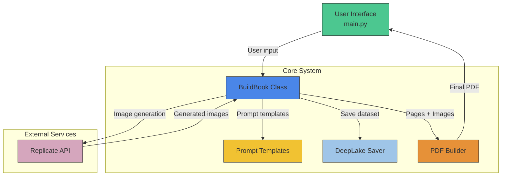

# Book Generator Architecture

## Key components and flows:
1. **User Interface (`main.py`)**:
   - Streamlit-based UI
   - Collects user input (prompt, style)
   - Triggers book generation
   - Displays debug info and download link

2. **Book Builder (`api_utils.py`)**:
   - Orchestrates entire workflow
   - Uses `ChatOpenAI` for story generation
   - Manages character consistency
   - Handles parallel image generation
   - Coordinates with other components

3. **Prompt Engine (`prompts.py`)**:
   - Contains all prompt templates
   - Defines function schemas for:
     - Visual descriptions
     - Character references
     - Lighting/atmosphere

4. **PDF Generator (`pdf_gen_utils.py`)**:
   - Creates title pages
   - Adds text overlays to images
   - Merges pages into final PDF
   - Handles font embedding

5. **Deep Lake Integration (`deep_lake_utils.py`)**:
   - Saves prompts + images to dataset
   - Handles API token validation
   - Creates dataset if missing

6. **External Services**:
   - Replicate API for image generation
   - Deep Lake for dataset storage

## Workflow sequence:
1. User provides input via Streamlit UI
2. `BuildBook` generates story text using prompts
3. Visual descriptions are created for each page
4. Images are generated via Replicate API
5. Pages are compiled into PDF
6. (Optional) Data saved to Deep Lake
7. PDF returned to user
